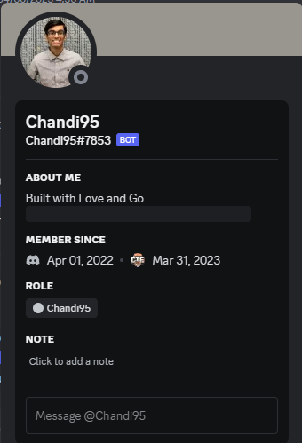
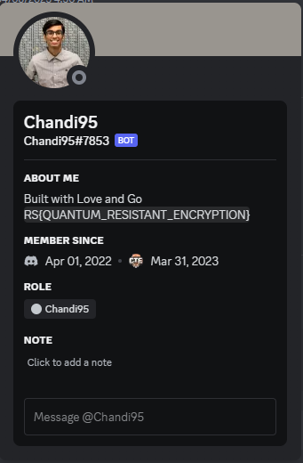
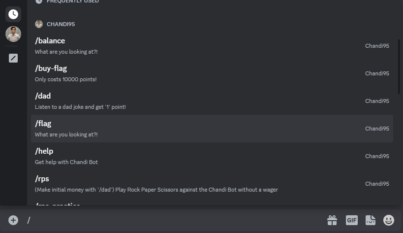
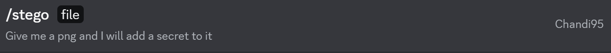

# Chandi Bot

## Task 1

---

### Description

Have you noticed the funny bot on the server?

### Solution

<!-- check description for the bot on discord: -->

Upon checking the server member list, the following bot is found:

The description of the bot has another message maked as spoiler:

### Flag

RS{QUANTUM_RESISTANT_ENCRYPTION}

## Task 2

---

### Description

Looks like the bot has some functionality.

### Solution

In the channel "chandi-bot" we can checkout the bot commands:

The soltion is to use the command `/flag`.

### Flag

RS{HMMM_WHAT_ARE_YOU_LOOKING_AT}

## Task 3

---

### Description

I wonder what the bot's favorite dinosaur is?

### Solution

Using the same channel as before, we can use the command `/stego` and attaching an image to it (the command says it will attach a secret message to the image, so its a steg challege).

After downloading the image, we can use `zsteg` to extract the flag.

### Flag

RS{GO_GET_THE_ENCODED_FLAG}

## Task 4

---

### Description

Can you beat the bot?

### Solution

This time we need the followind 5 commands:

- /balance - to check our balance
- /rps - to play rock paper scissors and bet on it
- /rps-practice - to play rock paper scissors without betting
- /dad - to get 1 point
- /buy-flag - to buy the flag for 10000 points

We start with 0 points, so we need to get 10k points to buy the flag. We can use the `/dad` command to get 1 point each time we use it. We can use the `/rps-practice` command to play without betting and get the hang of it. After that we can use the `/rps` command to bet on it and get more points. We can use the `/balance` command to check our balance.

The `/rps` commands has 2 arguments: our choice and a wager. We cant bet with 0 points, but if we bet negative points, we can get points if we lose. Using this start we can get 10k points and buy the flag.

### Flag

RS{TWO_NEGATIVES_DO_MAKE_A_POSITIVE}

## Task 5

---

### Description

How much do you know about RITSEC?

### Solution

This time we have the `/trivia` command. The questions are about RITSEC, so we can google them and get the answers. The good part is they are also repeating so we can just copy paste the answers. Just keep track of the good answers and you will get the flag.

### Flag

RS{TRIVIAL_TRIVIA_TRIUMPHS}

## Task 6

---

### Description

We finally found the source code. Can you dig through find the secret?

https://github.com/1nv8rzim/Chandi-Bot

### Solution

Find the flag in the commit logs. I just looked at the issues fixed and checked the commit logs for the flag.

### Flag

RS{GIT_CHECKOUT_THIS_FLAG}
